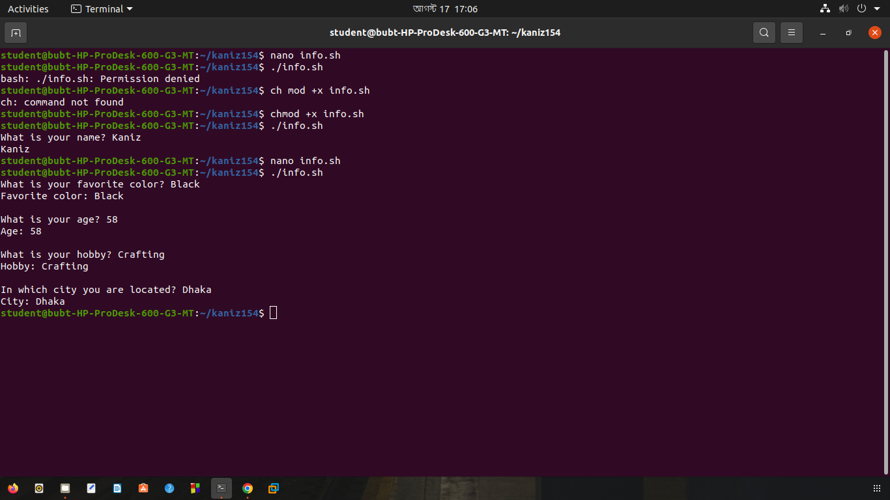
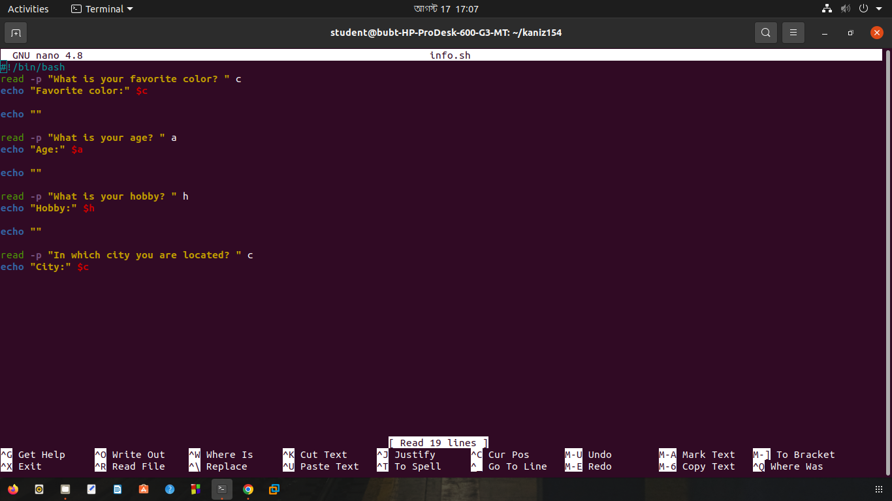
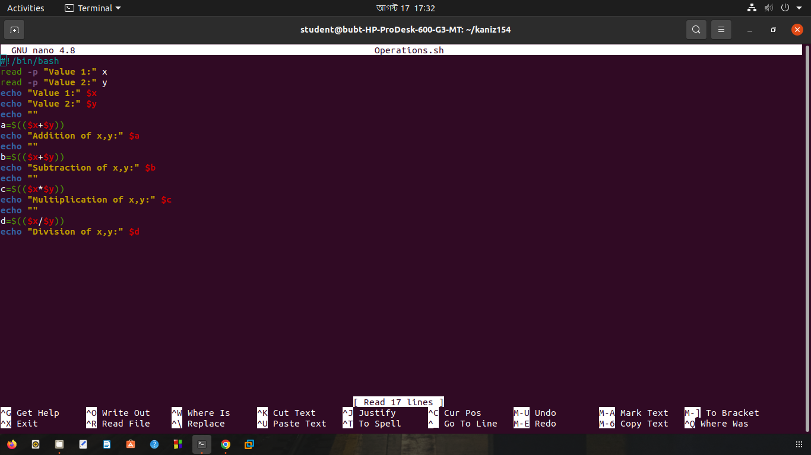
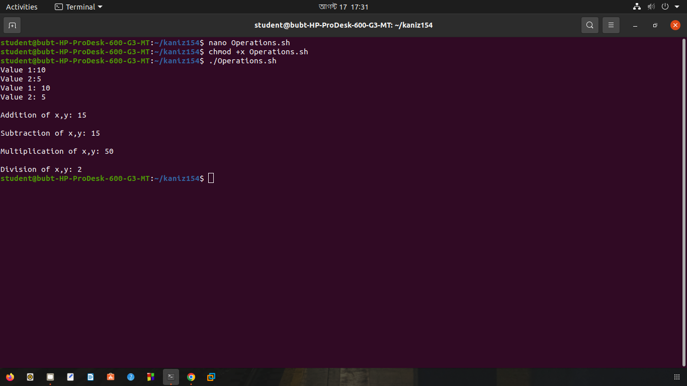
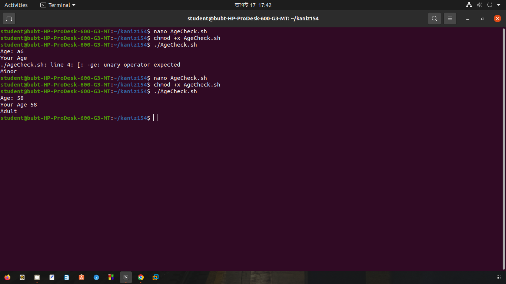
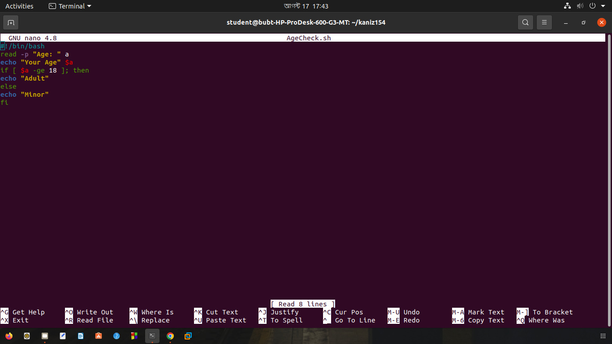
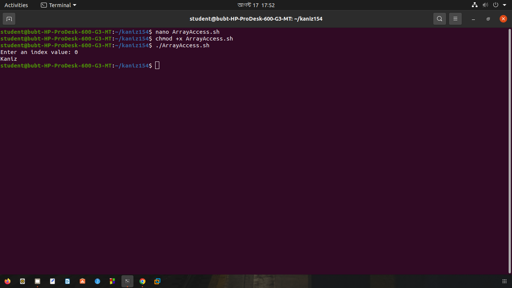
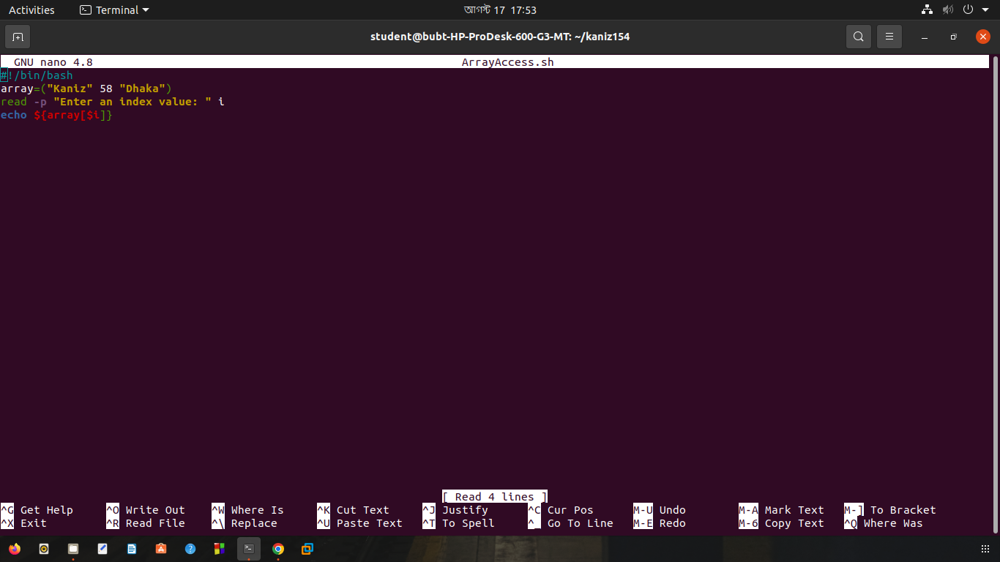

# Lab 03: Introduction to Shell Scripts

In this lab, we practiced basic shell scripting in Linux, user input/output, variables, arithmetic operations, conditions, and arrays.

## Task 1: User Details (Info.sh) 

- Create a bash script named Info.sh 
- Ask the user for their favorite color by echoing “What is your favorite color?” 
- Store the color in a variable 
- Print the stored variable in the following way: 
> Favorite Color: Blue 
Similarly, ask for the age, hobby, and city separately. 

```bash
mkdir kaniz154
nano info.sh
#!/bin/bash

read -p "What is your favorite color? " c
echo "Favorite color:" $c
echo ""
read -p "What is your age? " a
echo "Age:" $a
echo ""
read -p "What is your hobby? " h
echo "Hobby:" $h
echo ""
read -p "In which city you are located? " c
echo "City:" $c

chmod +x info.sh
./info.sh 
```



## Task 2: Basic Operations (Operations.sh)

- Create a bash script named Operations.sh 
- Take two integer inputs for numbers. 
- Perform the following operations and print the results: 
- Addition of the two numbers 
- Subtraction (number 1 minus number 2) 
- Multiplication 
- Division (integer division)

```
nano Operations.sh 

#!/bin/bash
read -p "Value 1:" x
read -p "Value 2:" y
echo "Value 1:" $x
echo "Value 2:" $y
echo ""
a=$(($x+$y))
echo "Addition of x,y:" $a
echo ""
b=$(($x+$y))
echo "Subtraction of x,y:" $b
echo ""
c=$(($x*$y))
echo "Multiplication of x,y:" $c
echo ""
d=$(($x/$y))
echo "Division of x,y:" $d

chmod +x Operations.sh
./Operations.sh

```



## Task 3: Age Comparison (AgeCheck.sh)

- Create a bash script named AgeCheck.sh 
- Ask the user to input their age. 
- If the age is 18 or above, print “Adult” 
Else, print “Minor”

```bash
nano AgeCheck.sh

#!/bin/bash
read -p "Age: " a
echo "Your Age" $a
if [ $a -ge 18 ]; then
echo "Adult"
else
echo "Minor"
fi

chmod +x AgeCheck.sh
./AgeCheck.sh
```



## Task 4: Array Element Access (ArrayAccess.sh) 

- Create a bash script named ArrayAccess.sh 
- Create an array with at least 3 elements: name, age, city 
- Take input from the user for an index number (e.g., 0, 1, or 2). 
- Use the input index number to print the corresponding value from the array. 
> For example, if the user inputs 0, print the value at index 0 (name)

```bash
nano ArrayAccess.sh
#!/bin/bash
array=("Kaniz" 58 "Dhaka")
read -p "Enter an index value: " i
echo ${array[$i]}
chmod +x ArrayAccess.sh
./ArrayAccess.sh
```



