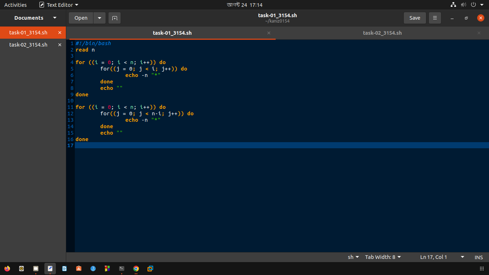
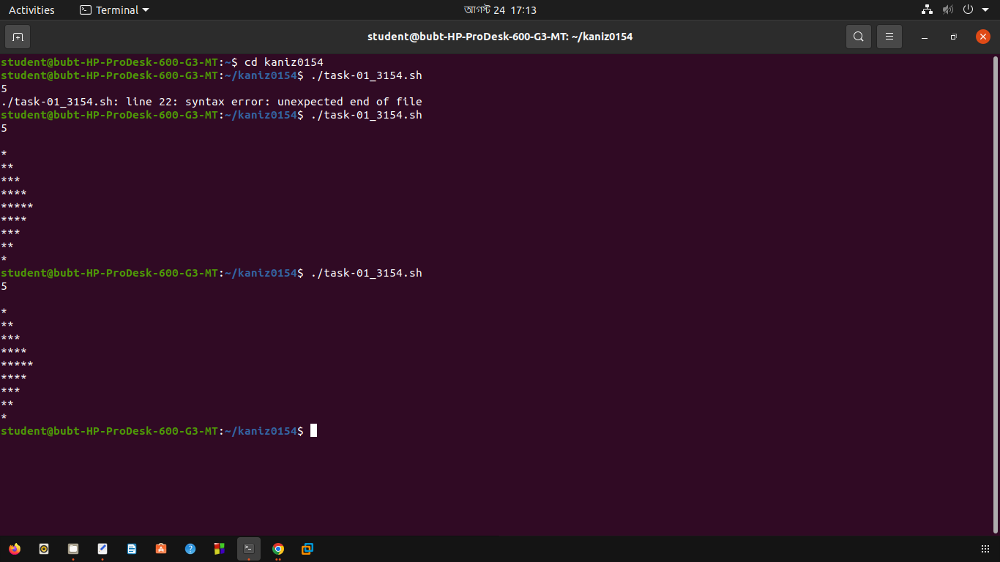
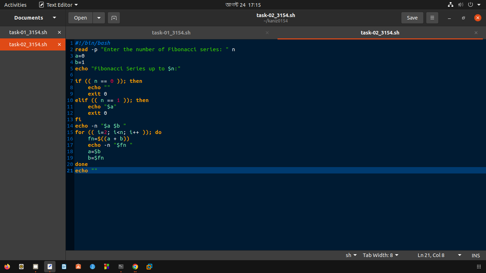
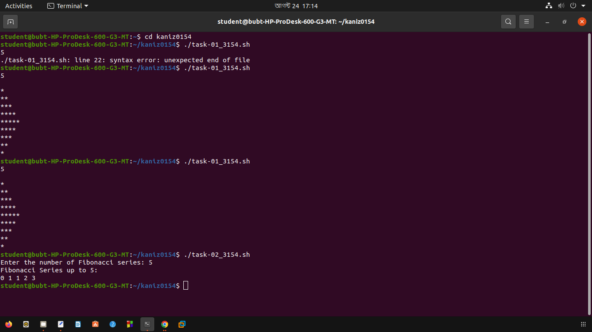
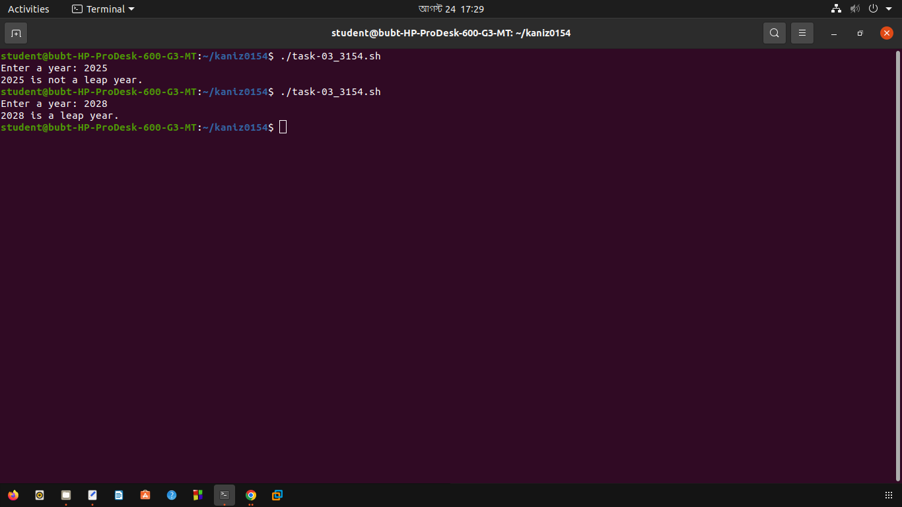
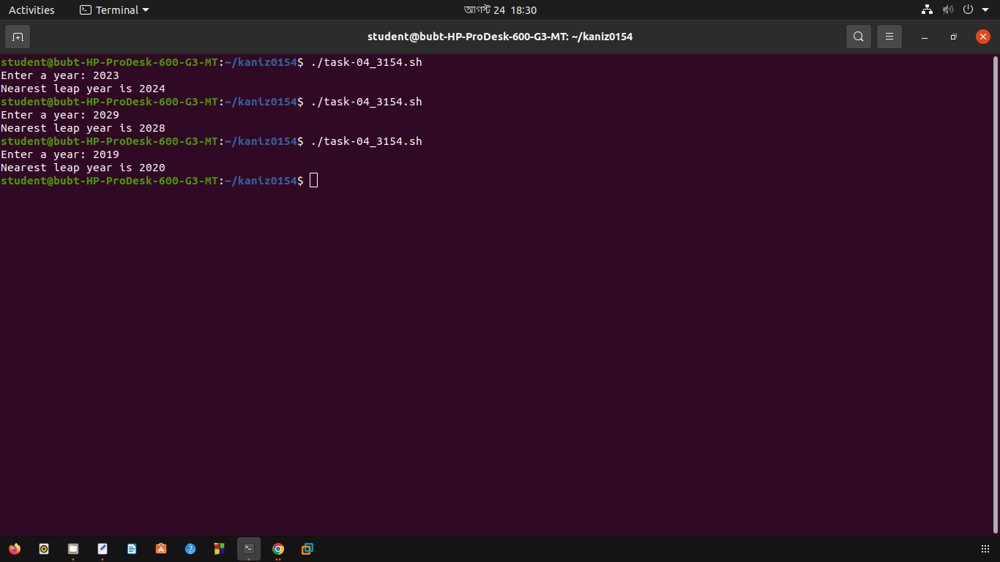
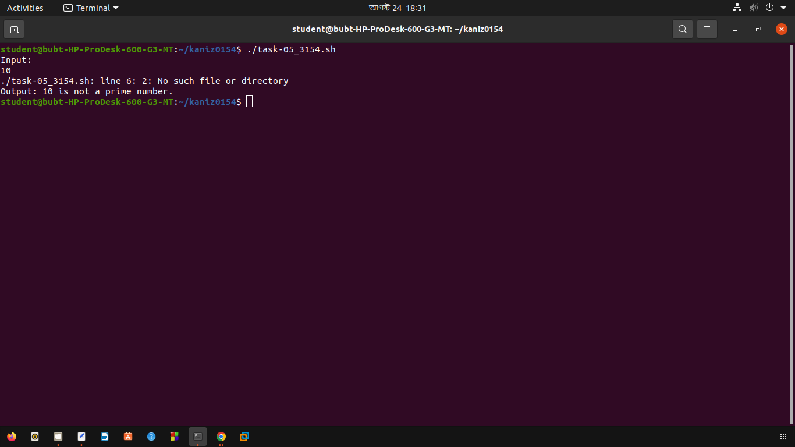
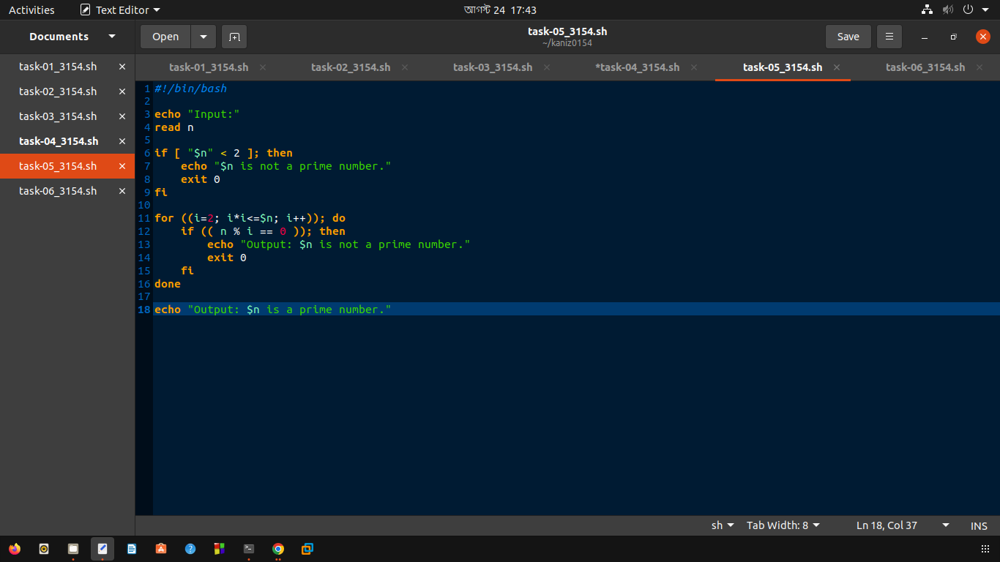
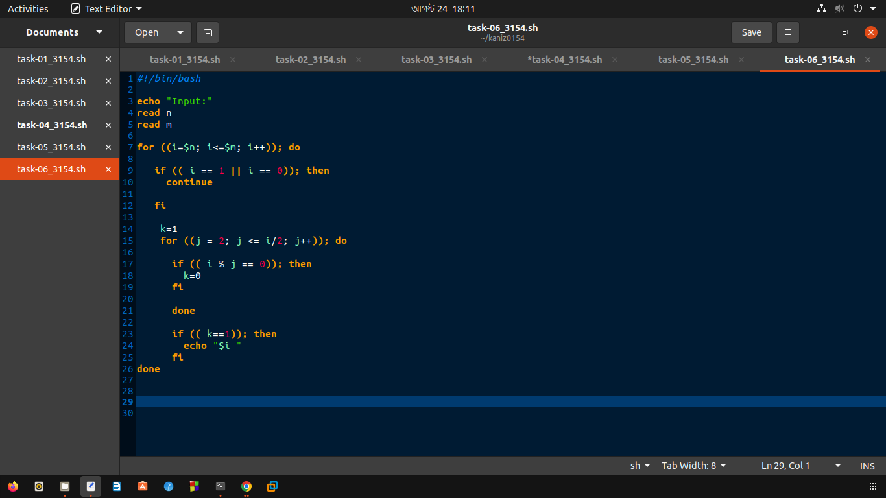
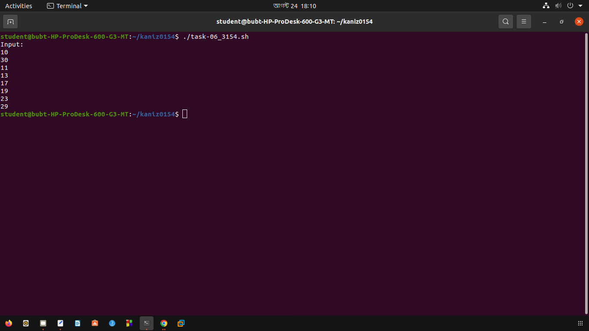

# Lab 4: Let's Loop


## Creating Shell Scripts

-   Create a new directory inside `$HOME` and navigate to it:

Create directory
```bash
mkdir kaniz0154
cd kaniz0154
```
-   Create six `.sh` files for six individual tasks:

```bash
touch task-01_3154.sh
touch task-02_3154.sh
touch task-03_3154.sh
touch task-04_3154.sh
touch task-05_3154.sh
touch task-06_3154.sh
```
-   Change permissions of the `.sh` files to be able to run them as executables:

 ```bash
chmod +x task-01_3154.sh
chmod +x task-02_3154.sh
chmod +x task-03_3154.sh
chmod +x task-04_3154.sh
chmod +x task-05_3154.sh
chmod +x task-06_3154.sh
```
# Lab Tasks

## Task 1: Pattern

**Output:**

```bash
5
```

**Output:**

```bash
*
**
***
****
*****
****
***
**
*
```

**Script:**

```bash
#!/bin/bash
read n
for ((i = 0; i < n; i++)) do 
	for((j = 0; j < i; j++)) do
		echo -n "*"
	done
	echo ""
done

for ((i = 0; i < n; i++)) do 
	for((j = 0; j < n-i; j++)) do
		echo -n "*"
	done
	echo ""
done
```
**Show output:**
Run in terminal

```bash
./task-01_3154.sh
```



## Task 2: Fibonacci

Print the Fibonacci series in terminal with a bash script.

**Input:**

```bash
5
```

**Output:**

```bash
1 1 2 3 5
```

**Script:**
```bash
#!/bin/bash
read -p "Enter the number of Fibonacci series: " n
a=0
b=1
echo "Fibonacci Series up to $n:"

if (( n == 0 )); then
    echo ""
    exit 0
elif (( n == 1 )); then
    echo "$a"
    exit 0
fi
echo -n "$b "
for (( i=2; i<=n; i++ )); do
    fn=$((a + b))
    echo -n "$fn "
    a=$b
    b=$fn
done
echo ""
```
**Show output:**
Run in terminal
```bash
./task-02_3154.sh
```



## Task 3: Leap Year
Write a bash script to find if a year is leap year or not.

> [!TIP]
> A leap is either divisible by 400 or 4 but not divisible by 100.

**Input:**

```bash
2020
```

**Output:**

```bash
2020 is a leap year.
```

**Script:**
```bash
#!/bin/bash

echo -n "Enter a year: "
read year

if (( ((year % 400 == 0) || (year % 4 == 0)) && (year % 100 != 0) )); then
    echo "$year is a leap year."
else
    echo "$year is not a leap year."
fi
```
**Show output:**
Run in terminal
```bash
./task-03_3154.sh
```


## Task 4: Nearest Leap Year

Write a bash script to find the nearest leap year from the current year.

> [!TIP]
> If year **2023** is given as the input, then the nearest leap year is **2024**. If **2021** is given the nearest leap year is **2020**. If **2022** is given you can either print
> **2020** or **2024**.

**Input:**

```bash
2020
```

**Output:**

```bash
Nearest leap year: 2024
```

**Script:**
```bash
#!/bin/bash

echo -n "Enter a year: "
read year

y1=$((year + 1))
y2=$((year - 1))

k=1
while [ $k -le 4 ]; do

if (( (y1 % 400 == 0 || y1 % 4 == 0) && y1 % 100 != 0 )); then
    break
fi
((y1++))
((k++))

done

k=4
while [ $k -ge 0 ]; do

if (( (y2 % 400 == 0 || y2 % 4 == 0) && (y2 % 100 != 0) )); then

    break
fi
((y2--))
((k--))


done

forwards=$((y1 - year))
backwards=$((year - y2))

echo -n "Nearest leap year: "
if [ $backwards -lt $forwards ]; then
	echo $y2
else
	echo $y1
fi
```
**Show output:**
Run in terminal

```bash
./task-04_3154.sh
```


## Task 5
Write a bash script to check whether a given number is a prime number.

**Input:**

```bash
7
```

**Output:**

```bash
7 is a prime number.
```

**Script:**

```bash
#!/bin/bash

echo "Input:"
read n

if [ $n -lt 2 ]; then
    echo "$n is not a prime number."
    exit 0
fi

for ((i=2; i<=$n/2; i++)); do
    if (( n % i == 0 )); then
        echo "Output: $n is not a prime number."
        exit 0
    fi
done

echo "Output: $n is a prime number."
```
```bash
./task-05_3154.sh
```



## Task 6: List Prime Numbers
Write a bash script to find and print all prime numbers between two given numbers (_inclusive_)

**Input:**

```bash
10
30
```

**Output:**

```bash
11 13 17 19 23 29
```

**Script:**

```bash
#!/bin/bash

echo "Input:"
read n
read m

for ((i=$n; i<=$m; i++)); do
   if (( i == 1 || i == 0)); then
     continue
     
   fi
            
    k=1
    for ((j = 2; j <= i/2; j++)); do
 
      if (( i % j == 0)); then
        k=0
      fi
      done
      if (( k==1)); then
        echo "$i "
      fi
done
```
**Show output:**
Run in terminal
```bash
./task-06_3154.sh
```


