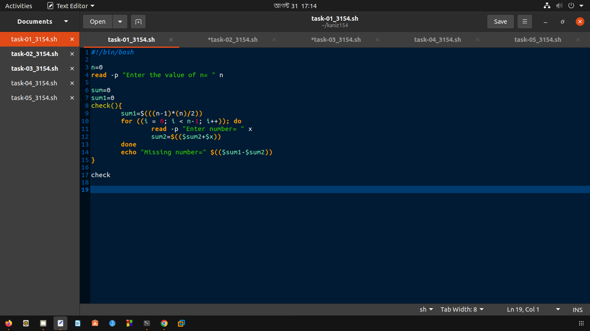
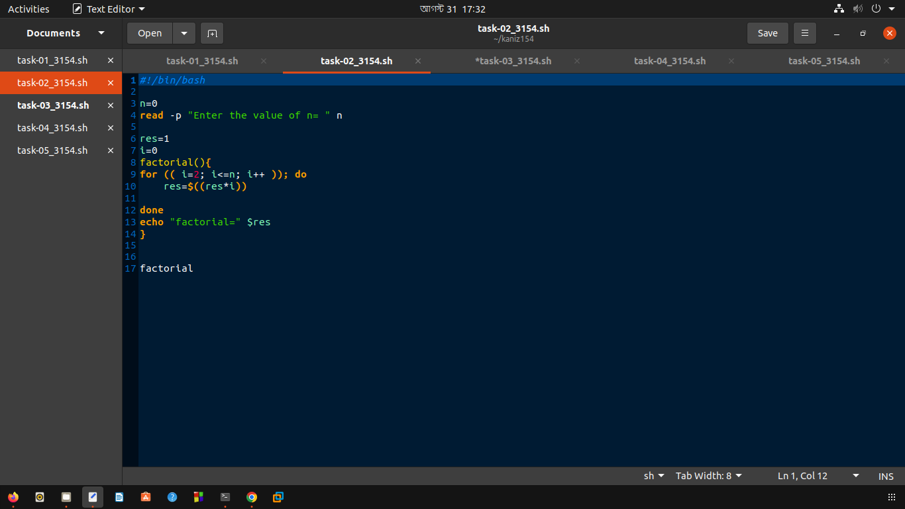
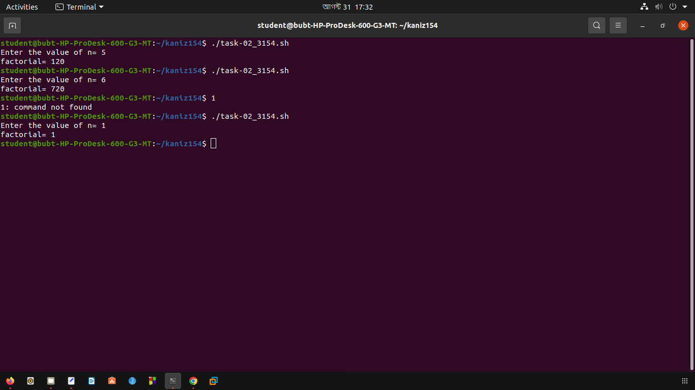
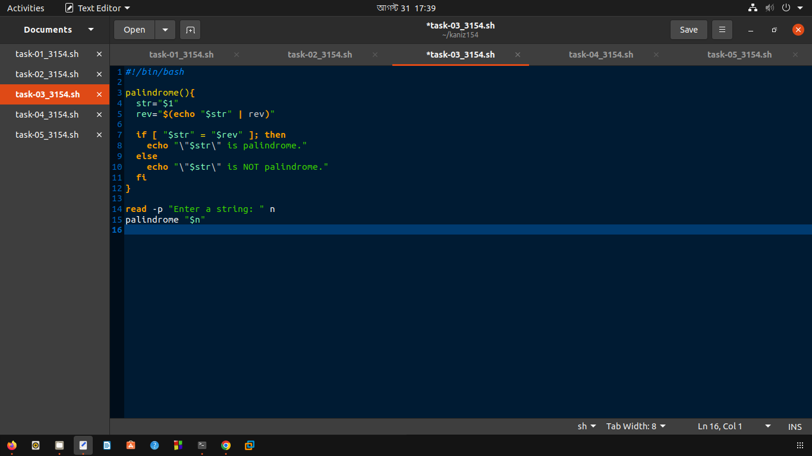
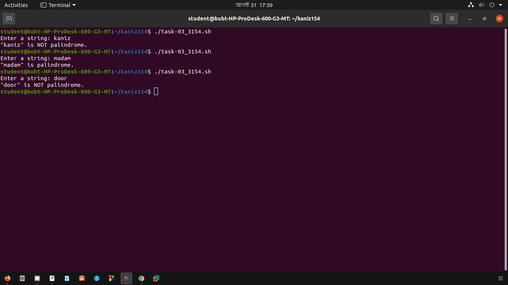
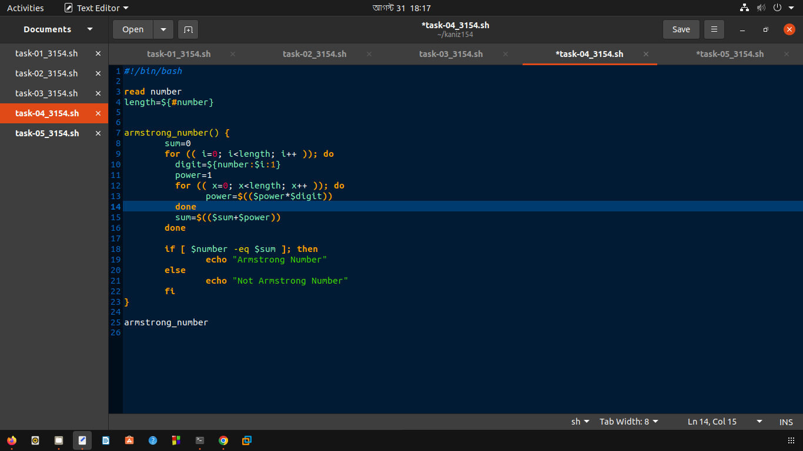
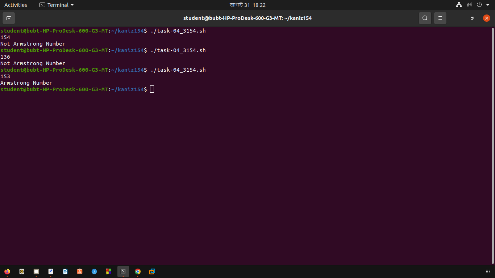
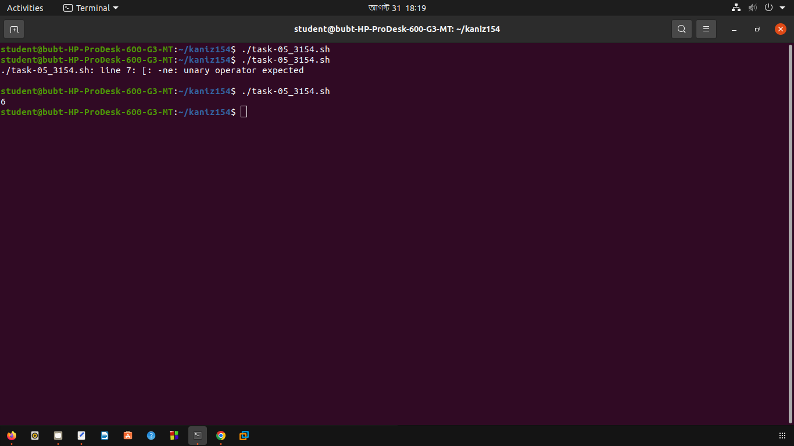

# Lab 5: Functions 

## Creating Shell Scripts

-   Create a new directory inside `$HOME` and navigate to it:

    ```bash
    mkdir kaniz154
    cd kaniz154
    ```

-   Create six `.sh` files for six individual tasks:

    ```bash
    touch task-01_3154.sh
    touch task-02_3154.sh
    touch task-03_3154.sh
    touch task-04_3154.sh
    touch task-05_3154.sh
    ```

-   Change permissions of the `.sh` files to be able to run them as executables:

    ```bash
    chmod +x task-01_3154.sh
    chmod +x task-02_3154.sh
    chmod +x task-03_3154.sh
    chmod +x task-04_3154.sh
    chmod +x task-05_3154.sh
    ```

# Lab Tasks

## 1. Missing number

Given a range from 0 to n, a number is missing. Create a function to find that missing number and echo that number.

**Test Cases:**

```bash
Input : 0 3 2
Output: 1
```

```bash
Input : 0 3 1 2 5
Output: 4
```

**Script:**

```bash
#!/bin/bash

n=0
read -p "Enter the value of n= " n

sum=0
sum1=0
check(){
	sum1=$(((n-1)*(n)/2))
	for ((i = 0; i < n-1; i++)); do
		read -p "Enter number= " x
		sum2=$(($sum2+$x))
	done
	echo "Missing number=" $(($sum1-$sum2))
}

check
```



## 2. Factorial

Write a function that takes a number as input and returns its factorial.

**Input:**

```bash
5
```

**Output:**

```bash
120
```

**Script:**

```bash
#!/bin/bash

n=0
read -p "Enter the value of n= " n

res=1
i=0
factorial(){
for (( i=2; i<=n; i++ )); do
    res=$((res*i))
    
done
echo "factorial=" $res
}

factorial
```




## 3. Palindrome Check

Write a function that checks if a string is a palindrome.

**Test Cases:**

```bash
Input : madam
Output: Palindrome
```

```bash
Input : hello
Output: Not Palindrome
```

**Script:**

```bash
#!/bin/bash

palindrome(){
  str="$1"
  rev="$(echo "$str" | rev)"

  if [ "$str" = "$rev" ]; then
    echo "\"$str\" is palindrome."
  else
    echo "\"$str\" is NOT palindrome."
  fi
}

read -p "Enter a string: " n
palindrome "$n"
```




## 4. Armstrong Number Check

Write a function to check if a number is an Armstrong number.

**Test Cases:**

```bash
Input : 153
Output: Armstrong Number
```

```bash
Input : 123
Output: Not Armstrong Number
```

**Script:**

```bash
#!/bin/bash

read number
length=${#number}

armstrong_number() {
	sum=0
	for (( i=0; i<length; i++ )); do
	  digit=${number:$i:1}
	  power=1
	  for (( x=0; x<length; x++ )); do
	  	power=$(($power*$digit))
	  done
	  sum=$(($sum+$power))
	done
	
	if [ $number -eq $sum ]; then
		echo "Armstrong Number"
	else
		echo "Not Armstrong Number"
	fi
}

armstrong_number
```




## 5. Greatest Common Divisor

Write a function that finds the GCD of two numbers.

**Input:**

```bash
12 18
```

**Output:**

```bash
6
```

**Script:**

```bash
#!/bin/bash

gcd() {
	local a=$1
	local b=$2
	
	while [ $b -ne 0 ]; do
		r=$(($a % $b))
		a=$b
		b=$r
	done
	echo $a
}

gcd 48 18
```

